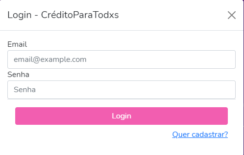
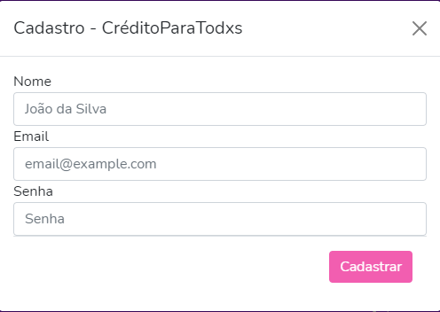
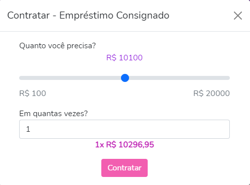
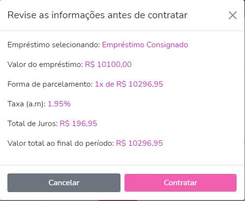

# CréditoParaTodxs - Crédito Pessoal Simplificado

# Live Demo
O Sistema está hospedado no Heroku https://creditoparatodxs.herokuapp.com/

#
## Requisitos

Baixe e instale os seguintes requisitos antes de iniciar o projeto

- [Node.js](https://nodejs.org/en/download/)
- [MongoDB](https://docs.mongodb.com/manual/installation/#mongodb-installation-tutorials)

#

## Instalação do sistema

Clone o repositório

```bash
git clone https://github.com/jaisonklemer/projeto-serasa-credito
```

Instale as dependências com o comando:

```bash
npm i
```

#
## Rodando o sistema

Crie um arquivo `.env` no diretório raiz.

Edite este arquivo com a STRING de conexão com o MongoDB,

Por exemplo:

```bash
DB_CONNECTION=mongodb://localhost:27017/credito
```

Popule o Banco de Dados com dados iniciais com o comando:

```bash
npm run seed
```

Para executar o sistema, execute o comando:

```bash
npm run start
```

O servidor será iniciado em `localhost:5000`

#

## Instruções de Uso

### Realizando o login ou cadastro

 - Na tela inicial o usuário pode fazer login



 - Ou realizar o cadastro




### Fazer uma simulação

- Para simular, selecione um empréstimo entre os disponíveis e clique em `Simular`.

- Escolha o valor desejado, junto com a quantidade de parcelas.



- Clicando em `Contratar`, será mostrado um novo modal para revisão das informações.



- Para finalizar, confirme clicando em `Contratar`.

#

## Tecnologias e Recursos Utilizados

- [Node.js](https://nodejs.org/)
- [MongoDB](https://mongodb.com/)
- [Express.js](https://expressjs.com/pt-br/)
- [Bootstrap 5](https://getbootstrap.com/)
- [Ilustrações by unDraw](https://undraw.co/illustrations)

